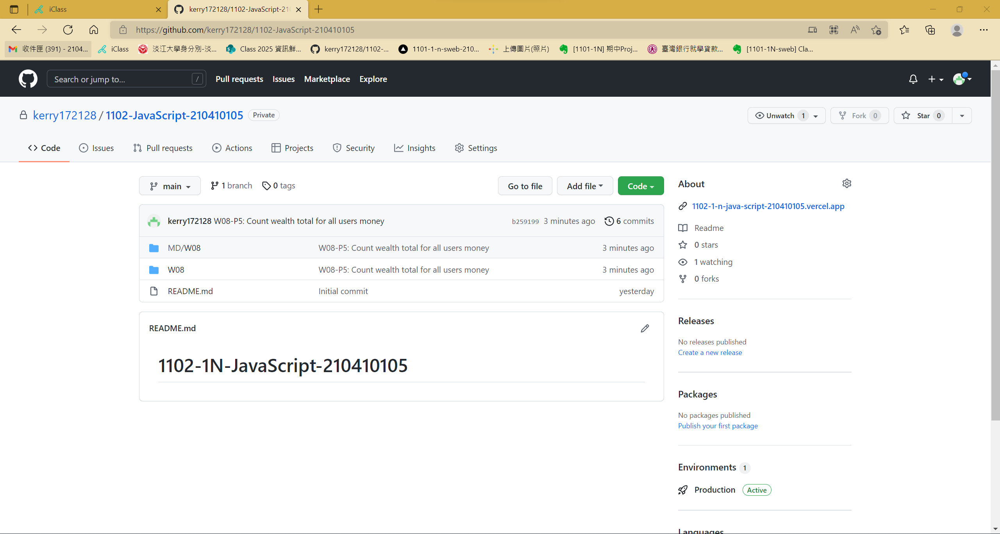
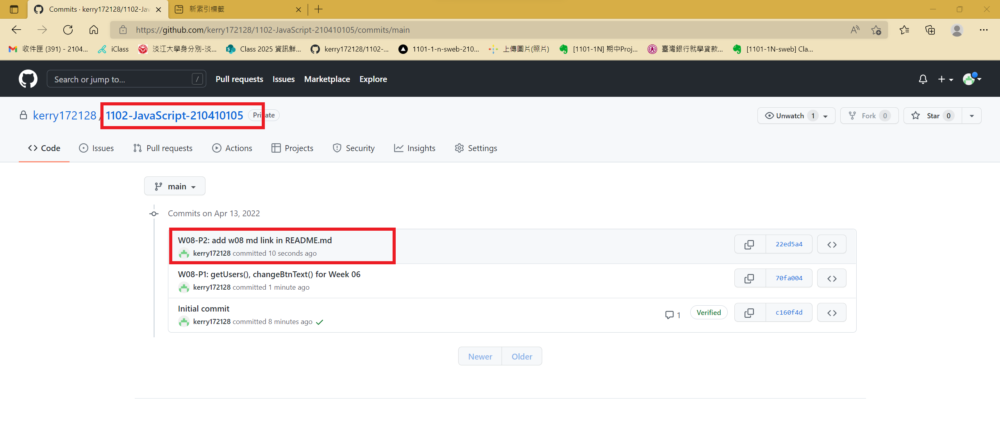
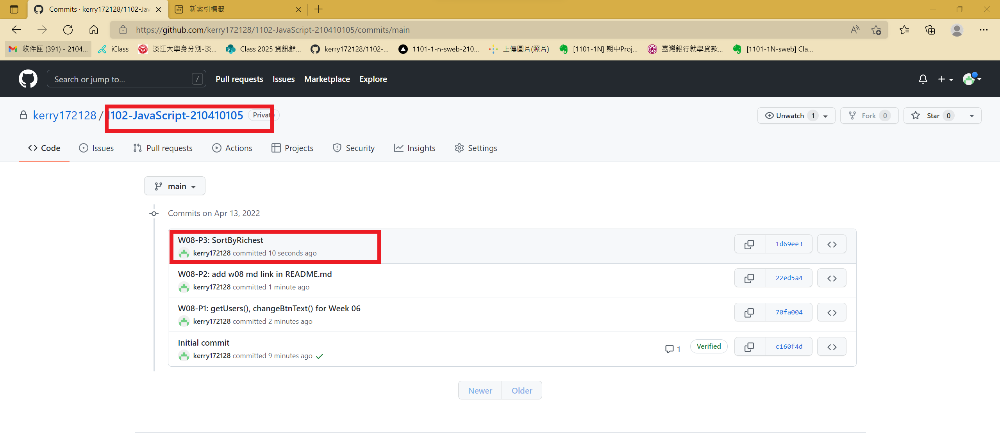
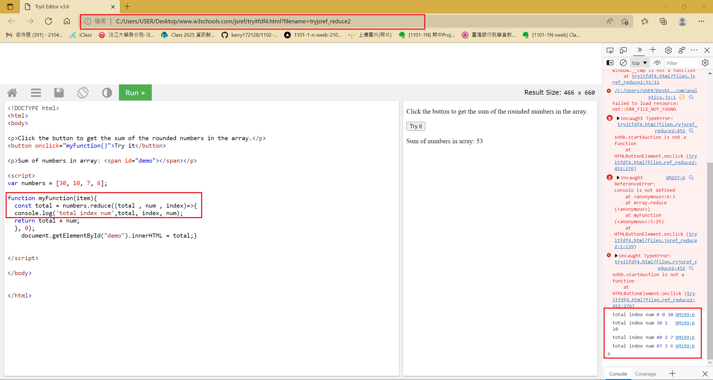
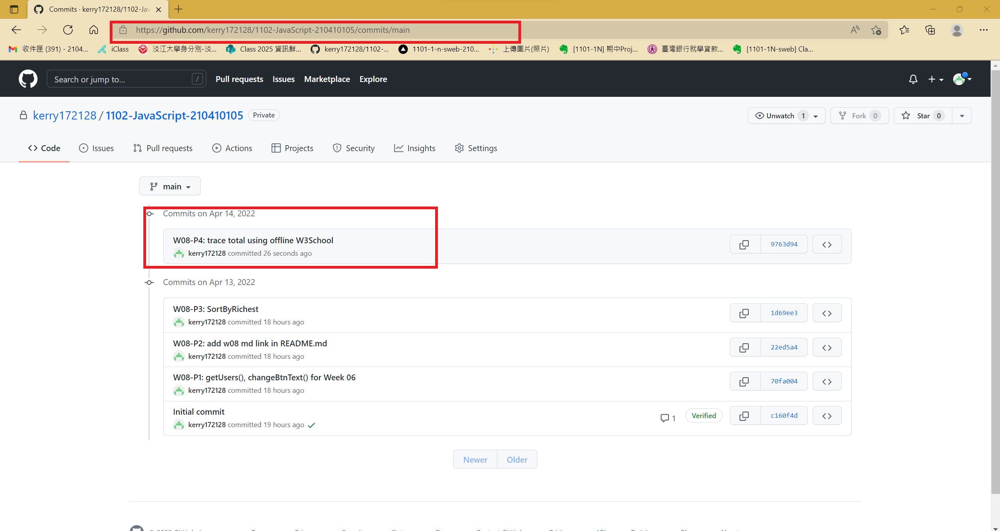
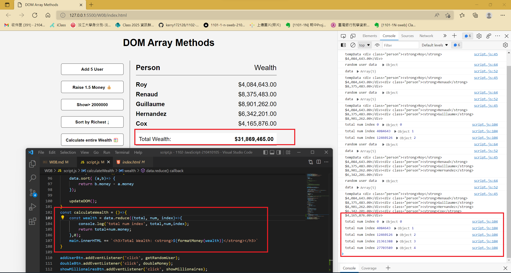
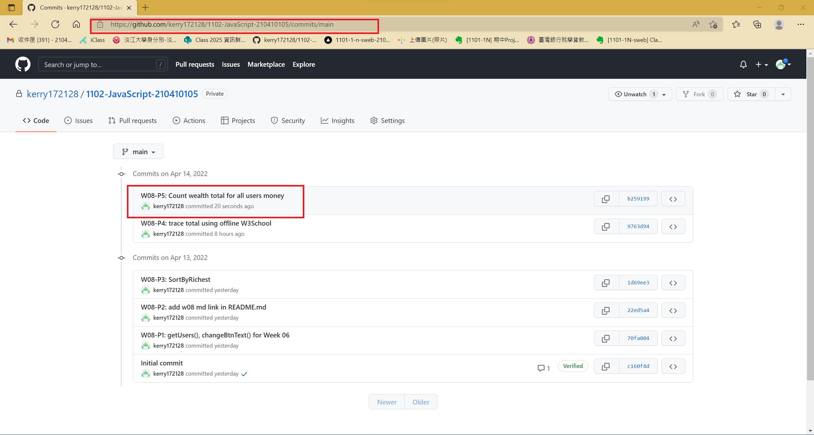

[Github page](https://github.com/kerry172128/1102-JavaScript-210410105)

### P1: getUsers(), changeBtnText() for Week 06

### W08-P2: add w08 md link in README.md

### W08-P3:SortByRichest

### W08-P4: trace total using offline W3School

### W08-P5: Count wealth total for all users money

