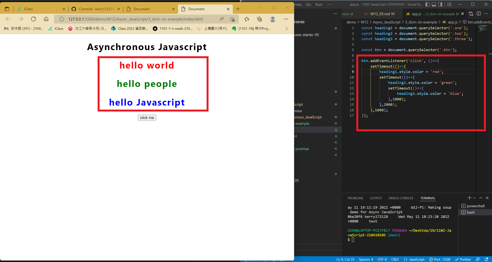
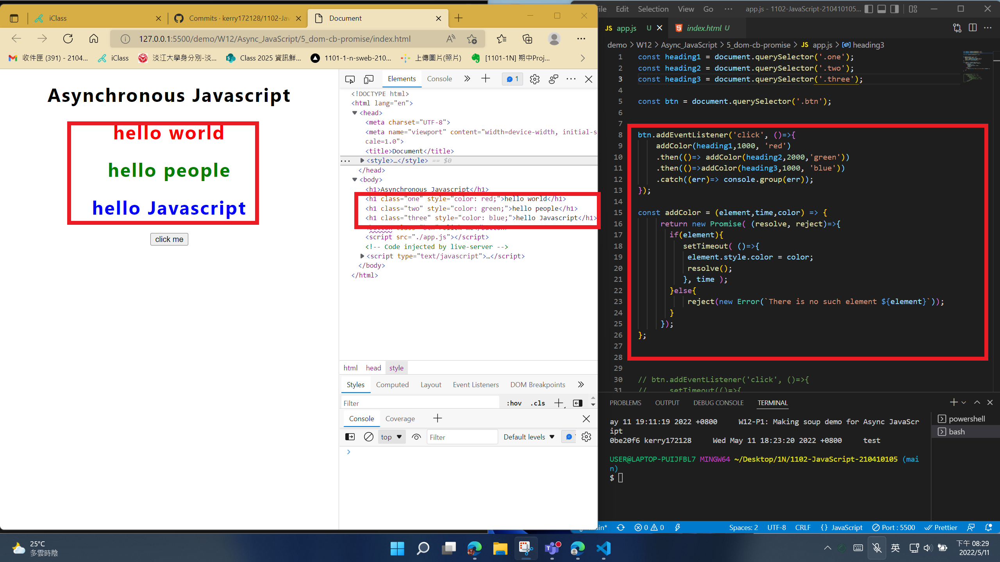
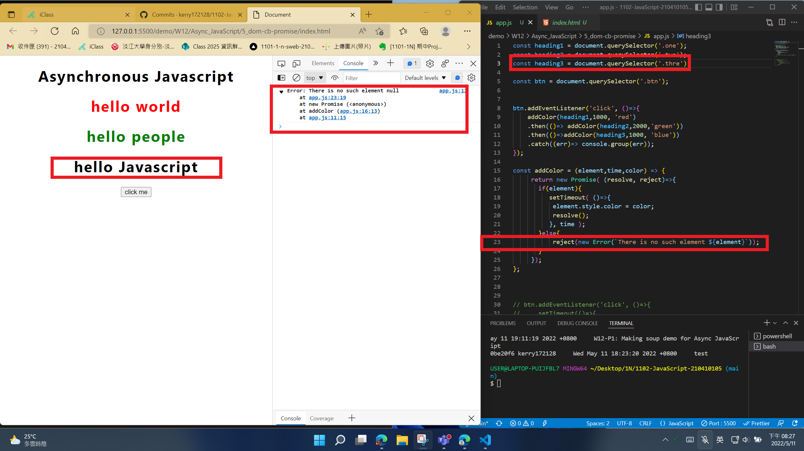

### W12-P1: Making soup demo for Async JavaScript with log info


```
$ git log --pretty=format:"%h%x09%an%x09%ad%x09%s" --after="2022-05-10"
7152625 kerry172128     Wed May 11 19:11:19 2022 +0800     W12-P1: Making soup demo for Async JavaScript
```

### w12-P2 DOM call-back functions demo -- colors change from red (1s), green (2s), blue (1s)




### w12-P3 use promise addColor(element,time,color) to solve-call back hell in w12-P2





### LAST log on "2022-05-11"