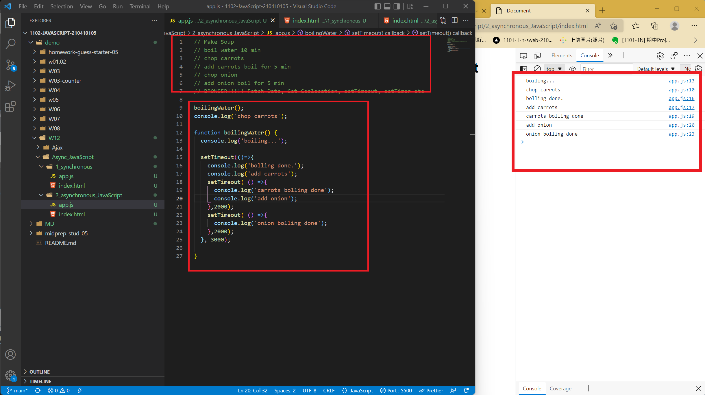

[Github page](https://github.com/kerry172128/1102-JavaScript-210410105)

### W12-P1: Making soup demo for Async JavaScript with log info



```
$ git log --pretty=format:"%h%x09%an%x09%ad%x09%s" --after="2022-05-10"
7152625 kerry172128     Wed May 11 19:11:19 2022 +0800     W12-P1: Making soup demo for Async JavaScript
```

### w12-P2 DOM call-back functions demo -- colors change from red (1s), green (2s), blue (1s)


### w12-P3 use promise addColor(element,time,color) to solve-call back hell in w12-P2


### w12-P4 use async /await for w12-P3


### w12-P5 fetch people.json with 4 data shown on console, change name to people2.json will result in error


### LAST log on "2022-05-11"


```
$ git log --pretty=format:"%h%x09%an%x09%ad%x09%s" --after="2022-05-10"
64390f3 kerry172128     Wed May 11 21:04:24 2022 +0800  ### w12-P4 use async /await for w12-P3
6e79888 kerry172128     Wed May 11 20:34:26 2022 +0800  ### w12-P3 use promise addColor(element,time,color) to solve-call back hell in w12-P2
e23102c kerry172128     Wed May 11 20:33:38 2022 +0800  ### w12-P2 DOM call-back functions demo -- colors change from red (1s), green (2s), blue (1s)
7152625 kerry172128     Wed May 11 19:11:19 2022 +0800  W12-P1: Making soup demo for Async JavaScript
0be20f6 kerry172128     Wed May 11 18:23:20 2022 +0800  test
```